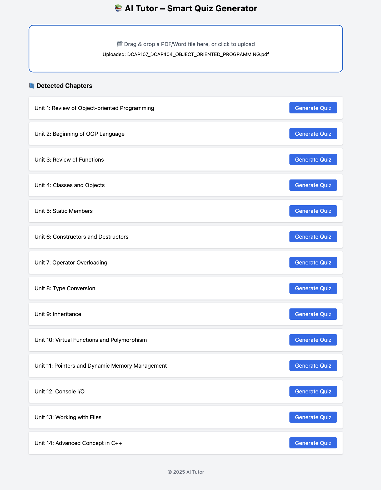
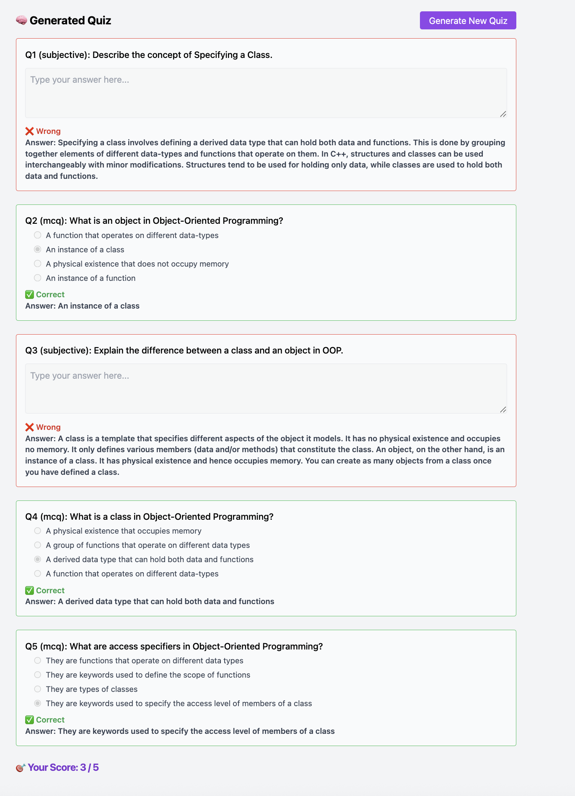

# LearnMate Quiz Studio

LearnMate Quiz Studio is a full-stack study assistant that turns PDF or DOCX study material into chapter-wise practice quizzes. The app extracts chapters, stores document metadata, asks an LLM to generate questions, and lets students attempt a short quiz in the browser.

This project is adapted from the MIT-licensed `negiadventures/ai-tutor` repository. The implementation has been customized with a new product name, refreshed UI, clearer workflow copy, and expanded documentation. Keep this attribution if you publish or submit the project.

## Current Progress

This project has been improved into a hackathon-ready local quiz generator focused on PDF, DOCX, scanned notes, and OOP/OOPM study material.

- Project cleanup rules were tightened so `.env`, `.venv`, `node_modules`, `frontend/dist`, uploads, logs, cache folders, and local database files stay out of version control.
- Backend quiz generation now uses stable `document_id` and `chapter_id` routes instead of relying only on book title and chapter number.
- Uploads now support a background job flow with status polling, which is safer for larger PDFs and OCR-heavy files.
- Upload file size validation was added with `MAX_UPLOAD_BYTES`.
- Alembic migration scaffolding was added so database schema setup can use migrations instead of automatic table creation.
- Quiz validation was strengthened to reject broken LLM output, duplicate questions, fill-in-the-blank fragments, one-word options, fake OCR/source-quality questions, and malformed MCQs.
- The app now supports difficulty and question-type controls.
- Quiz review now includes explanations, retry for wrong answers, recent score history, CSV export, and print/PDF export.
- The text review panel now supports save, reset, and unsaved-change protection.
- Local Ollama support was improved with a custom `learnmate-quiz` model profile built from `qwen2.5:7b`.
- OOPS/OOPM notes were added as a focused sample domain with few-shot quiz examples and an OOP concept fallback for terms like classes, objects, encapsulation, inheritance, polymorphism, abstraction, constructors, destructors, virtual functions, garbage collection, and the diamond problem.
- The backend now merges weak model output with raw-text OOP fallback questions so OOPM notes still generate useful quizzes even when Ollama returns too few valid questions.
- Automated test coverage was expanded for upload limits, LLM JSON parsing, quiz validation, OOP fallback generation, and noisy OCR rejection.

## What It Does

- Upload one PDF or DOCX file.
- Upload clear photos or scanned PDFs when Tesseract OCR is installed.
- Extract title, author, content hash, and chapter sections.
- Save documents, chapters, and generated questions in the configured SQLAlchemy database.
- Generate practice quizzes for any selected chapter.
- Support MCQ, short-answer, and true/false style questions.
- Score submitted answers in the frontend.
- Run longer uploads through a background job with status polling.
- Choose quiz difficulty and question styles before generation.
- Review wrong answers, retry missed questions, and export results.
- Use a local Ollama model through `learnmate-quiz` for offline demo-friendly quiz generation.

## Screenshots





## Tech Stack And Why Each Technology Is Used

| Technology | Where Used | Why It Is Used |
| --- | --- | --- |
| React | `frontend/src` | Builds the interactive browser UI with reusable components for upload, chapter selection, and quiz attempts. |
| Vite | `frontend` | Provides a fast development server and optimized frontend build pipeline with minimal setup. |
| Tailwind CSS | `frontend/src/index.css`, component classes | Speeds up UI styling through utility classes and keeps the design consistent without writing large custom CSS files. |
| Axios | Frontend API calls | Handles HTTP requests to the FastAPI backend for file upload and quiz generation. |
| React Dropzone | Upload component | Gives a clean drag-and-drop file upload experience with PDF/DOCX file filtering. |
| Vitest + Testing Library | `frontend/src/test` | Tests React behavior from the user's point of view, such as visible buttons, quiz rendering, and error states. |
| FastAPI | `backend/app/main.py` | Exposes backend APIs with simple async request handling, validation, and automatic OpenAPI docs. |
| Uvicorn | Backend runtime | Runs the FastAPI application locally or inside Docker. |
| SQLAlchemy | `backend/app/models.py`, `crud.py`, `db.py` | Maps Python models to database tables and keeps database access organized. |
| MySQL + PyMySQL | Backend database | Stores uploaded document metadata, chapter text, and generated quiz questions persistently. |
| OpenAI Python SDK | `backend/app/llm_utils.py` | Sends chapter content to an LLM and receives quiz questions in JSON format. |
| Ollama | Local LLM runtime | Runs the custom `learnmate-quiz` model locally for free/offline-friendly quiz generation. |
| PyMuPDF + pdfplumber | PDF processing | Extracts text and metadata from PDF study material. |
| python-docx | DOCX processing | Reads Word document text and metadata. |
| Tesseract OCR + pytesseract | Image/scanned-file text extraction | Reads text from clear photos and scanned PDF pages when normal embedded text is not available. |
| scikit-learn | Text/chapter utilities | Supports text-analysis style processing used by the chapter extraction pipeline. |
| Docker + Docker Compose | `backend/Dockerfile`, `docker-compose.yml` | Makes backend deployment repeatable and helps run supporting services consistently. |
| Pytest | `backend/tests` | Tests backend helpers, CRUD logic, and LLM response parsing. |

## Project Structure

```text
backend/
  app/
    main.py          FastAPI routes for upload and quiz generation
    file_utils.py    File hashing, metadata extraction, and parsing helpers
    vectorize.py     Chapter heading/content extraction logic
    llm_utils.py     LLM prompt and JSON parsing
    models.py        SQLAlchemy database models
    crud.py          Database read/write functions
  ddl/               SQL scripts for database tables
  alembic/           Database migration environment and initial schema migration
  prompts/           Ollama Modelfile, OOP/OOPM sample input, and few-shot quiz examples
  tests/             Backend tests

frontend/
  src/
    App.jsx          Main dashboard layout and state
    components/      Upload, chapter list, and quiz components
    test/            Frontend component tests
```

## Requirements

- Python 3.10+
- Node.js 18+
- MySQL
- SQLite or MySQL database
- Ollama, recommended for local/free quiz generation
- OpenAI API key or compatible LLM endpoint, optional if using Ollama
- Tesseract OCR installed locally for photo/scanned-PDF reading
- Docker, optional for container-based backend running

## Local Ollama Model

The recommended local model for the current demo is `learnmate-quiz`, created from `backend/prompts/Modelfile.learnmate`.

Create it once:

```bash
cd backend/prompts
ollama create learnmate-quiz -f Modelfile.learnmate
```

Then set this in `backend/.env`:

```env
LLM_PROVIDER=ollama
OLLAMA_BASE_URL=http://127.0.0.1:11434
OLLAMA_MODEL=learnmate-quiz
```

The `learnmate-quiz` model is based on `qwen2.5:7b`, so Ollama stores a model layer of roughly 4.7 GB under the user-level Ollama cache. Do not delete that layer if you want this model to keep working.

To use the same model from another local project, keep Ollama running and use:

```env
OLLAMA_BASE_URL=http://127.0.0.1:11434
OLLAMA_MODEL=learnmate-quiz
```

On another computer, copy `backend/prompts/Modelfile.learnmate` and run `ollama create learnmate-quiz -f Modelfile.learnmate` there.

## Backend Setup

```bash
cd backend
copy .env.example .env
pip install -r requirements.txt
```

Update `backend/.env` with your database and LLM settings. Then run migrations:

```bash
cd backend
alembic upgrade head
```

The older SQL files in `backend/ddl/` are kept as schema reference, but Alembic is now the preferred database setup path.

Run locally:

```bash
cd backend
uvicorn app.main:app --host 127.0.0.1 --port 8001 --reload
```

Or run with Docker:

```bash
cd backend
docker-compose up --build
```

## Frontend Setup

```bash
cd frontend
copy .env.example .env
npm install
npm run dev
```

Set this in `frontend/.env`:

```env
VITE_API_BASE_URL=http://127.0.0.1:8001
```

Open `http://127.0.0.1:5173`.

## Environment Variables

| File | Variable | Purpose |
| --- | --- | --- |
| `backend/.env` | `DATABASE_URL` | SQLAlchemy database connection string. |
| `backend/.env` | `OPENAI_API_KEY` | API key for quiz generation. |
| `backend/.env` | `OPENAI_BASE_URL` | Optional base URL for OpenAI-compatible providers. |
| `backend/.env` | `LLM_PROVIDER` | Use `ollama` for local model generation or OpenAI-compatible settings for hosted models. |
| `backend/.env` | `OLLAMA_BASE_URL` | Ollama API URL, usually `http://127.0.0.1:11434`. |
| `backend/.env` | `OLLAMA_MODEL` | Local Ollama model name, recommended `learnmate-quiz`. |
| `backend/.env` | `CORS_ALLOWED_ORIGINS` | Allowed frontend origins, for example `http://localhost:5173`. |
| `backend/.env` | `UPLOAD_DIR` | Folder where uploaded files are stored. |
| `backend/.env` | `MAX_UPLOAD_BYTES` | Maximum upload size in bytes. Default is `26214400` / 25 MB. |
| `frontend/.env` | `VITE_API_BASE_URL` | Backend API URL used by the React app. |

## API Examples

Health check:

```bash
curl http://127.0.0.1:8001/health
```

Start a background upload:

```bash
curl -X POST http://127.0.0.1:8001/upload/background \
  -F "file=@notes.pdf"
```

Poll the upload job:

```bash
curl http://127.0.0.1:8001/jobs/<job_id>
```

Generate a quiz by stable document and chapter IDs:

```bash
curl -X POST "http://127.0.0.1:8001/documents/1/chapters/3/quiz?difficulty=medium&question_types=mcq,true_false"
```

The older `/generate-quiz/?book=...&chapter_number=...` endpoint still works for compatibility, but ID-based quiz generation avoids conflicts when two documents share the same title.

## OOPM Sample Workflow

This repo includes `OOPS Notes.pdf` as a sample study file and an extracted clean sample input at `backend/prompts/oops_sample_input.txt`.

Recommended demo flow:

1. Start Ollama and make sure `learnmate-quiz` exists with `ollama list`.
2. Start the backend on `http://127.0.0.1:8001`.
3. Start the frontend on `http://127.0.0.1:5173`.
4. Upload `OOPS Notes.pdf`.
5. Review the extracted text. If the PDF section is an answer key or noisy OCR, edit it in the Review extracted text panel.
6. Generate a quiz for OOP concepts such as constructor, destructor, inheritance, polymorphism, abstraction, virtual functions, and garbage collection.

If Ollama returns too few valid questions, the backend now uses OOP-specific raw-text fallback questions instead of showing fake quiz questions about source quality.

## Tests

Backend:

```bash
cd backend
.\.venv\Scripts\python.exe -m pytest tests -v
```

Frontend:

```bash
cd frontend
npm test
```

Production frontend build:

```bash
cd frontend
npm run build
```

## Project Cleanup Notes

Do not commit local runtime files such as `.env`, `.venv`, `node_modules`, `frontend/dist`, `backend/uploads`, logs, or local database files. The root `.gitignore` is configured for these generated artifacts.

Recent verification:

- Backend tests: `40 passed`
- Frontend tests: `9 passed`
- Frontend production build: passed

## Attribution And License

This project is based on work from `https://github.com/negiadventures/ai-tutor`, licensed under MIT. The adapted code should remain MIT-compatible, and attribution should be preserved when sharing the project.
